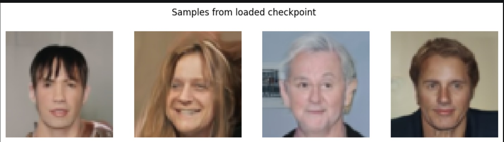
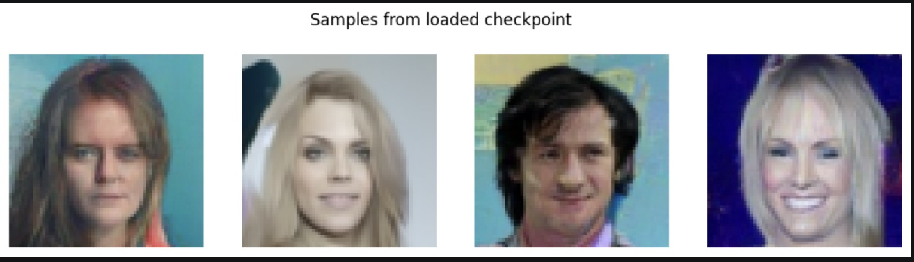

# Denoising Diffusion Probabilistic Model (DDPM)

A PyTorch implementation of a Denoising Diffusion Probabilistic Model from scratch, built end-to-end: custom U-Net architecture, closed-form forward diffusion, DDPM ancestral sampling, DDIM implicit sampling, and a training pipeline to train locally(6GB VRAM). The goal was to understand and correctly implement every step of the DDPM math by hand — the noise schedule, the forward and reverse processes, and the training objective — rather than relying on a pre-built diffusion library.

## 🧠 Architecture

**U-Net backbone.** A custom encoder-decoder U-Net (`Encoder_level` / `Decoder_level` / `Unet`) with:
- Residual blocks (`LayerBlock`) at each resolution level, each conditioned on the diffusion timestep via a projected time embedding added into the feature maps
- Skip connections between mirrored encoder/decoder resolutions, correctly threaded through matching channel counts at every level
- Self-attention layers restricted to the lower-resolution stages (16×16 and 8×8) — attention is expensive at full resolution and most valuable once feature maps are spatially compact
- A downsample/upsample path taking images from 64×64 down to an 8×8 bottleneck and back
- A zero-initialized output convolution, so the network starts training by predicting exactly zero noise — a standard stability trick that keeps early training well-behaved

**Time embedding.** Sinusoidal positional embedding of the timestep, projected through an MLP and injected into every residual block, so a single network can condition its denoising behavior on *how noisy* the input currently is.

**Noise schedule.** A cosine variance schedule (Nichol & Dhariwal formulation, `s=0.008` offset) rather than the original linear DDPM schedule — better preserves signal at intermediate timesteps and generally trains more stably.

**Forward process.** Closed-form sampling of `x_t` from `x_0` in a single step (`x_t = √ᾱ_t · x_0 + √(1-ᾱ_t) · ε`), avoiding the need to simulate the full Markov chain during training.

**Reverse process / DDPM sampling.** Full DDPM ancestral sampling implementing the posterior mean and variance formulas from Ho et al. (2020) — iteratively denoising from pure Gaussian noise back to an image over the trained timestep range, with variance-vs-standard-deviation handling in the stochastic reverse step.

**Reverse process / DDIM sampling.** Implemented DDIM (Denoising Implicit Models, Song et al. 2020) as an alternative sampler — a non-Markovian reformulation of the reverse process that reuses the *same* trained model, but generates images in far fewer steps by skipping across the timestep schedule. An `eta` parameter controls how much stochasticity is reintroduced at each step (`eta=0` gives fully deterministic sampling; `eta=1` recovers standard DDPM behavior). This makes iterating on sample quality during development substantially faster.


**Training objective.** The simplified noise-prediction loss `L_simple` — MSE between the model's predicted noise and the true injected noise — the objective Ho et al. showed outperforms optimizing the full variational lower bound directly.

## ⚙️ Engineering & Performance Work

A meaningful part of the project was diagnosing and fixing real issues at the PyTorch/CUDA level:

- **Mixed-precision training** (`torch.amp.autocast` + `GradScaler`) to exploit Ampere tensor cores, cutting per-step compute time substantially
- **cuDNN autotuning** (`torch.backends.cudnn.benchmark = True`) for the fixed 64×64 input shape
- **Systematic bottleneck profiling** — instrumented the training loop to separately time data loading vs. GPU compute per step, correctly diagnosing that the pipeline was compute-bound rather than I/O-bound before reaching for the right optimizations

- **VRAM budget management** on a 6GB laptop GPU — reasoning through memory accounting (weights + AdamW optimizer state + activations) to work within a tight hardware ceiling
- **Checkpoint integrity verification** — a full validation pass on saved weights: exact file-size reconciliation against parameter count, strict `state_dict` key matching, NaN/Inf scanning, a "did training actually happen" sanity check against the deliberately zero-initialized output layer, and a functional forward-pass test before trusting any checkpoint for inference

Several subtle bugs were found and fixed along the way that are easy to get wrong in a from-scratch DDPM implementation — broadcasting failures when moving from single-image to batched-timestep training, off-by-one errors in noise-schedule indexing between the forward and reverse processes, and a variance-vs-standard-deviation error in the stochastic sampling step (a bug that would silently produce lower-diversity, blurrier samples).

## 🛠️ Tech Stack

- **Deep Learning:** PyTorch (`torch.amp`, custom `nn.Module` architecture, manual autograd-based training loop)
- **Data:** Hugging Face `datasets` (CelebA-faces, streamed with lazy on-the-fly transforms via `set_transform` rather than eager preprocessing), `torchvision.transforms`
- **Visualization:** Matplotlib (forward-process previews, training progress snapshots, generated sample grids)
- **Language:** Python

## 📁 Project Structure

```
├── Unet.ipynb              # Model architecture: Encoder_level, Decoder_level, Unet,other Pytorch Modules
├── Foward.ipynb            # Noise schedule, forward process, DDPM sampling (reverse process)
├── DDPM train.ipynb             # Training loop, checkpointing
├── ddpm_unet_model_final.pth  # Saved checkpoint (model + optimizer state) (Not included in the Repo)
├── DDPM sample.ipynb
├── Sampled Images
└── README.md
```

## 🚀 How to Run

1. Clone the repository and navigate to this directory.
2. Install dependencies: `pip install torch torchvision datasets matplotlib`
3. Run `Unet.ipynb` and `Foward.ipynb` to define the model and diffusion schedule.
4. Run the training notebook to train and save a checkpoint.
5. Use the `ddpm_sample(model, batch_size, image_size)` function to generate images from a trained checkpoint.

## 📊 Results

* **DDPM sample outputs** 
* **DDIM sample outputs** 

## 🔭 Future Improvements

- **EMA (Exponential Moving Average)** of model weights — standard in diffusion training, typically gives a noticeable quality boost over raw weights at minimal cost
- **Classifier-free guidance / conditional generation** — CelebA ships with attribute labels (smiling, hair color, etc.); attribute-conditioned generation would be a natural extension
- **Quantitative evaluation** (FID / Inception Score) to benchmark sample quality objectively rather than relying on visual inspection

- **Fused attention** (`torch.nn.functional.scaled_dot_product_attention`) in place of manual QKV/softmax attention, for further speed and memory headroom

- **Latent diffusion (LDM)** — migrate from pixel-space to a compressed latent space using a pretrained VAE encoder/decoder, unlocking headroom for higher resolutions without the compute cost scaling with raw pixel count. Most valuable paired with the resolution increase above rather than as a standalone change at the current 64×64 scale.

- **Text conditioning via cross-attention** — add a `CrossAttention` module (image features as queries, text embeddings as keys/values) alongside the existing self-attention layers, conditioned on a pretrained text encoder (CLIP). Requires either templated pseudo-captions from CelebA's attribute labels, auto-generated captions (e.g. via BLIP), or a switch to a captioned dataset.

- **Higher resolution** (128×128 / 256×256) via progressive training or a latent-diffusion approach


## 📚 References

* **Denoising Diffusion Probabilistic Models (DDPM)** 
  Ho, J., Jain, A., & Abbeel, P. (2020). Advances in Neural Information Processing Systems, 33, 6840-6851. [arXiv:2006.11239](https://arxiv.org/abs/2006.11239)

* **Denoising Diffusion Implicit Models (DDIM)** 
  Song, J., Meng, C., & Ermon, S. (2020). International Conference on Learning Representations. [arXiv:2010.02502](https://arxiv.org/abs/2010.02502)

* **Improved Denoising Diffusion Probabilistic Models (Cosine Schedule)** 
  Nichol, A. Q., & Dhariwal, P. (2021). International Conference on Machine Learning, 8162-8171. [arXiv:2102.09672](https://arxiv.org/abs/2102.09672)

* **U-Net: Convolutional Networks for Biomedical Image Segmentation** 
  Ronneberger, O., Fischer, P., & Brox, T. (2015). Medical Image Computing and Computer-Assisted Intervention–MICCAI 2015, 234-241. [arXiv:1505.04597](https://arxiv.org/abs/1505.04597)

*  **What are Diffusion Models?** 
  Weng, L. (2021). Lil'Log. [lilianweng.github.io](https://lilianweng.github.io/posts/2021-07-11-diffusion-models/)

* **Advanced Diffusion Architectures** 
  APXML Courses. [apxml.com](https://apxml.com/courses/advanced-diffusion-architectures)